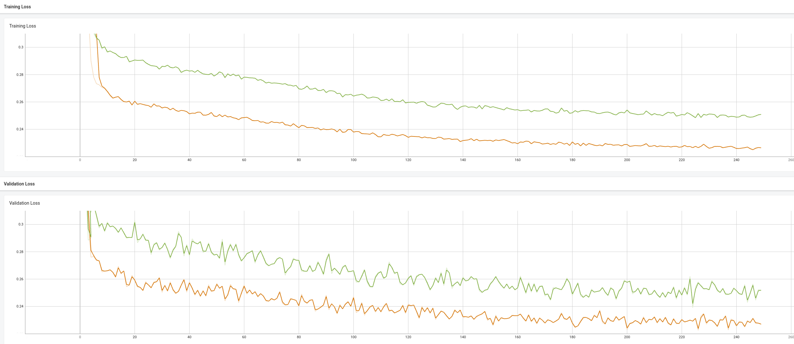

# Anomaly_Detection_3D
An implementation of Anomaly Detection in 3D Point Clouds using Deep Geometric Descriptors by Paul Bergmann and David Sattlegger

## Anomaly Detection Results

The below output is the result of the model trained on the synthetic dataset and tested on the mvtec dataset. The checkpoint file used here are `test_pretrain1` and `test_student1` respectively. Further more the scale factor calculated for the mvtec dataset is `0.003884387259059637` where as the same for ModelNet10 (Synthetic dataset) is `0.026817005398559565`. 

<p align="center">
  
  
</p>

- The points in the yellow color are the anomalies detected by the model. The model rightnow is having a bit of false positives and false negatives. The model can be further trained on more number of points to get better results.
- The threshold value used in the above case in using the percentile value of the normalised anomaly scores. The threshold value is calculated as `np.percentile(anomaly_scores, 95)`. The threshold value can be further tuned to get better results. This value intuits that the 95% of the points are normal and the rest 5% are anomalies.

## Getting Started

```bash
git clone https://github.com/yashmewada9618/Anomaly_Detection_3D.git
cd Anomaly_Detection_3D
pip install -r requirements.txt
```

## Prepare directory structure for synthetic dataset generation

```bash
cd Anomaly_Detection_3D/
mkdir -p datasets/pretrained_dataset/FPS_PCD datasets/pretrained_dataset/Original_PCD datasets/pretrained_dataset/Scenes datasets pretrained_dataset/train pretrained_dataset/val
mkdir -p datasets/mvtec_point_clouds
cd datasets
curl -S curl -S -O https://3dvision.princeton.edu/projects/2014/3DShapeNets/ModelNet10.zip
unzip ModelNet10.zip
```

## Prepare directory structure for mvtec dataset generation

```bash
cd Anomaly_Detection_3D/datasets
mkdir -p datasets/MvTec_3D
curl -S -O https://www.mydrive.ch/shares/45920/dd1eb345346df066c63b5c95676b961b/download/428824485-1643285832/mvtec_3d_anomaly_detection.tar.xz
tar -xvf mvtec_3d_anomaly_detection.tar.xz -C MvTec_3D/
```


## Run python code to generate synthetic dataset

```bash
cd Anomaly_Detection_3D/
python3 dataset_generation/synthetic_data_generation.py
```

## Run python code to generate mvtec dataset (Optional as the dataloader already loads the .tiff files and converts to pcd)

```bash
cd Anomaly_Detection_3D/
python3 dataset_generation/mvtec_dataset_generation
```

## Teacher loss plots


## Student loss plots


## Testing by changing the number of points from 16000 to 13000 (Experimental runs)



